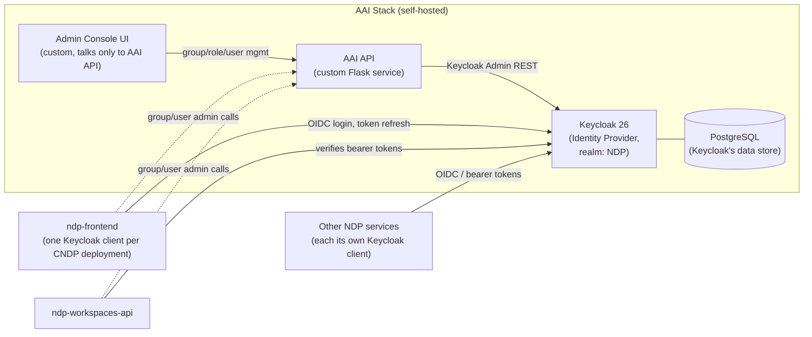

# Keycloak Across NDP: Current Integration & the New Authorization Model

**Purpose:** (1) summarize how NDP services currently use the Keycloak-based identity stack and what user data flows through it, and (2) introduce the new client-scoped authorization model that addresses the risks that picture exposes.

---

## Part 1 — Current State of Keycloak Integration Across NDP Services

### 1.1 The stack

Identity and access for NDP runs on a self-hosted stack, all maintained by the AAI (Authentication & Authorization Infrastructure) team:

- **Keycloak 26** is the identity provider (IdP) for the single `NDP` realm — every NDP-affiliated service authenticates users against it.
- **PostgreSQL** is Keycloak's backing store (users, groups, roles, sessions).
- **AAI API** is a custom Flask service that sits in front of Keycloak's Admin REST API. Instead of handing product teams direct Keycloak admin credentials, they call this API, which enforces a group-based permission model on their behalf (see below) and is the only thing with standing admin access to Keycloak.
- **Admin Console UI** is a custom front-end for the AAI API, used to manage groups, roles, members, and attributes without touching Keycloak's own admin console.

**How permissions are modeled today:** access is organized around Keycloak **groups** (e.g. `ndp_ep/ep-123`, each group automatically gets three realm roles named `group:<path>:admin`, `group:<path>:editor`, `group:<path>:viewer`; `jhub_user`). The AAI API checks these role names to decide whether a caller can manage a given group. This is the mechanism that lets teams self-serve group/role management without a central admin doing it by hand.

**What every client currently receives:** regardless of which of the above a service actually needs, Keycloak's default token mappers put the **user's full group membership (every group, platform-wide) and full realm role list (every role, platform-wide)** into every access token it issues, for every client. This is the pattern that motivates Part 2.

### 1.2 How individual services use it

Two service teams documented their own integration in detail; both are condensed here as illustrative examples of the same underlying pattern.

#### ndp-frontend

- **How it authenticates:** standard OIDC Authorization Code + PKCE (via NextAuth), one dedicated Keycloak client per CNDP deployment, each with its own client ID/secret.
- **What it retrieves from Keycloak:** at login, the user's `sub`, `name`, `email`, `preferred_username`, and a custom onboarding flag. On every permission check, it reads `realm_access.roles` (**all** realm roles the user holds, not just ones relevant to this app) and a `groups` claim (**every** group path the user belongs to) directly out of the access token.
- **Where that data lives:** identity claims, access token, and refresh token are held in an encrypted, server-side session cookie (4-hour lifetime); the decoded roles/groups are additionally cached in the browser's `localStorage` for the same window.
- **Admin operations:** group creation, membership changes, and per-deployment client provisioning go through the AAI API using a service-account credential, not the logged-in user's own token.
- **Sensitive info exposed to this client:** real name, email, and — critically — the user's complete group and role footprint across the entire NDP platform, even though a given CNDP deployment only ever needs to check membership in a small, fixed set of groups/roles relevant to it.

#### ndp-workspaces-api

- **How it authenticates:** verifies the bearer JWT issued by Keycloak on every request (no login flow of its own) and decodes it — `sub` becomes the user's canonical `keycloak_id`, alongside username, email, name, `realm_access.roles`, and `groups`, all taken as-is from the token.
- **Where that data lives:** `keycloak_id` is stored as the identity/ownership key on essentially every table in the workspaces database (workspaces, classrooms, data challenges, projects, sites, bookmarks, catalog entries, alerts, user profiles, and endpoint access requests) — roughly a dozen tables and ~35 API schemas carry it directly. For endpoint access requests and user profiles specifically, the user's **name and email are additionally copied out of the token and stored in the database in plaintext**, independent of Keycloak.
- **Admin operations:** has its own wrapper around the Keycloak Admin REST API for group/user lookups and membership management (service-to-service, not end-user tokens).
- **Sensitive info exposed to this service:** the same platform-wide roles/groups as above, trusted directly from the token with no independent check of whether they're relevant to this service — plus a persisted copy of the user's name and email that outlives the login session entirely.

### 1.3 The pattern

Across both services (and, by construction of the current token mappers, every other NDP client):

- Every client gets the user's **entire** group membership and **entire** realm role list, not just what pertains to it.
- Clients trust that content directly, with no per-client filtering happening at the Keycloak layer.
- At least one service persists identity fields (name, email) from the token into its own database, so exposure isn't limited to the lifetime of a session.

This "put everything in the token, let each app sort out what it needs" design is the shared root cause behind the two problems Part 2 addresses.

---

## Part 2 — The New Authorization Model

### 2.1 The problem

**Over-broad tokens.** Because every client receives the same all-encompassing token, a token leaked or stolen from *any one* client — a browser session, a log line, a misconfigured proxy — discloses far more than "this person is logged in to this app." It discloses the user's complete group membership and role footprint across NDP: every program, dataset, or admin capability they have anywhere on the platform, whether or not it has anything to do with the app the token was actually issued for.

**Token size / infrastructure risk.** The same design means token size grows with the *total* number of groups and roles a user holds anywhere on NDP, not with what a given client needs. For users who accumulate many group memberships (e.g. instructors, admins, or endpoint owners), this can produce large `Authorization` headers and cookies. We've built tooling internally to measure this (summing role-name and group-path lengths per user across the realm), and the risk is concrete: reverse proxies commonly reject requests whose headers exceed a fixed size limit, which would surface as unexplained login/authorization failures for exactly the users with the broadest legitimate access.

Both problems trace back to the same root cause: **token content is scoped to the user, not to the client asking for it.**

### 2.2 The new model

We've been developing an authorization model that scopes both the *content* and the *validity* of a token to the specific client it was issued for:

1. **Client-scoped authorization via Group policies.** Each client gets its own Keycloak Authorization Services configuration with a **Group policy**: a rule that checks whether the user belongs to the specific group(s) that client actually cares about. Instead of a client reading a firehose of every group the user is in and figuring out relevance itself, the relevance check moves server-side, into Keycloak, scoped per client.

2. **Client-bound tokens.** A token issued through client A's login is only valid for authorizing against client A — **even if the same user also belongs to groups tied to client B.** A token stolen from client A can't be replayed against client B's API, regardless of what that user is otherwise entitled to.

Together, these mean a client's tokens shrink to contain only what that client needs, and a compromised token's blast radius is limited to the one client it was issued for — instead of, as today, exposing the user's entire cross-platform footprint and being potentially replayable anywhere that footprint would grant access.

### 2.3 How this would affect NDP services

Using the two services profiled in Part 1 as concrete examples of what changes:

- **ndp-frontend** currently reads `realm_access.roles` and the full `groups` array straight off the token for its permission checks, including a CMS-driven pattern where arbitrary additional groups can be referenced per page. Under the new model, ndp-frontend's Keycloak client would need its own Group policy that explicitly covers every group/role it currently depends on (`professor`, `catalog_admin`, `ckan_admin`, `jhub_user`, the per-deployment admin group, the `ndp_ep/*` composite groups, and any CMS-supplied ones) — anything not enumerated there would no longer show up implicitly just because it happened to be in the token.
- **ndp-workspaces-api** currently trusts whatever roles/groups arrive in the bearer token for nearly every route via `Depends(get_user_info)`. It would move to the same audience-restricted validation, and — by design — would stop seeing groups/roles that belong to other clients, even for the same user. Any workflow that currently relies on that (e.g., cross-service checks) would need to go through the AAI API's service-account path instead, which isn't affected by this change since it's a trusted backend call, not an end-user token.
- **Data already persisted outside Keycloak** (e.g., workspaces-api's stored `keycloak_name`/`keycloak_email`) is a related but separate exposure surface — this model reduces what's *in the token*, not what a service has already chosen to copy into its own database.

**Suggested next step:** treat Part 1 of this document as the template — before switching any given client over, audit exactly what claims/groups/roles it currently reads (as done here for ndp-frontend and ndp-workspaces-api), so its new Group policy is defined to match reality rather than guessed at. A phased rollout, client by client, starting with whichever service carries the most sensitive exposure today, avoids breaking checks that currently work only because the old token happened to contain everything.
